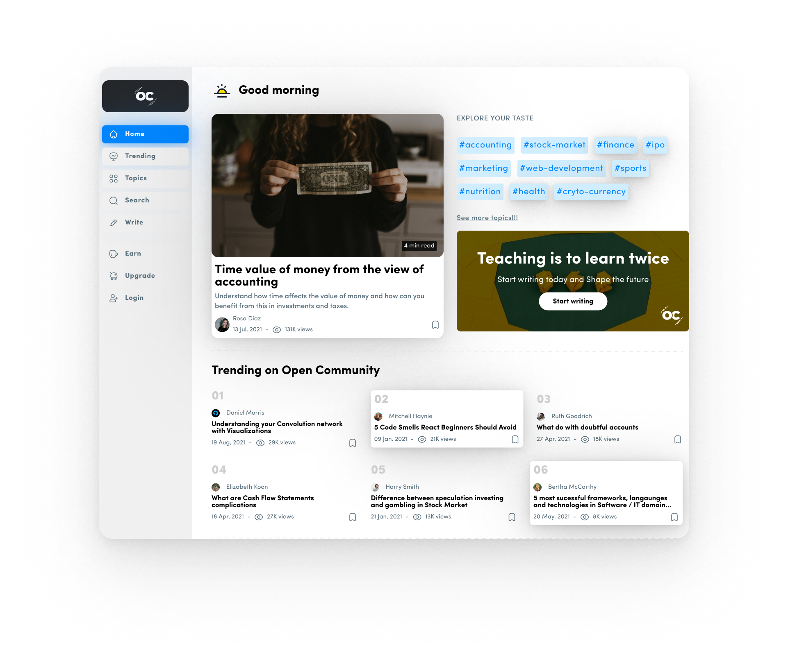
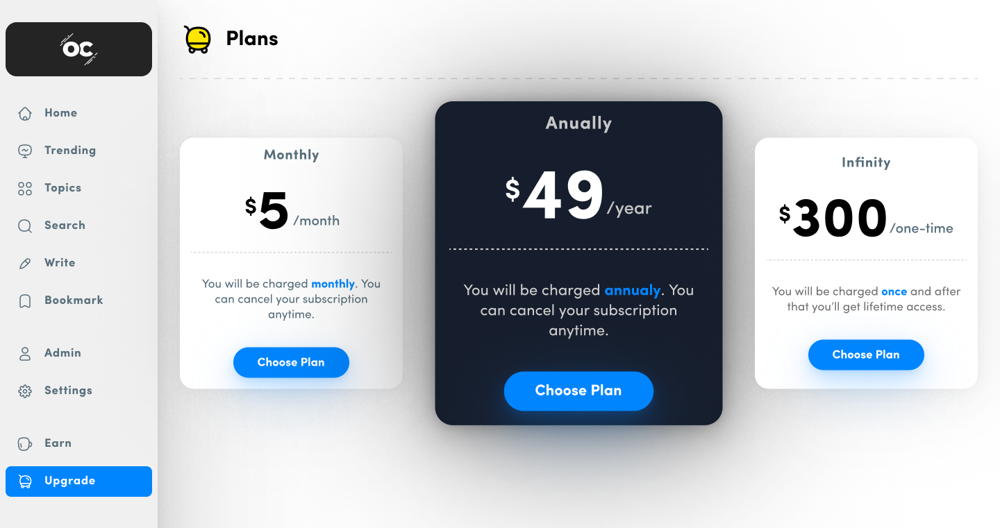
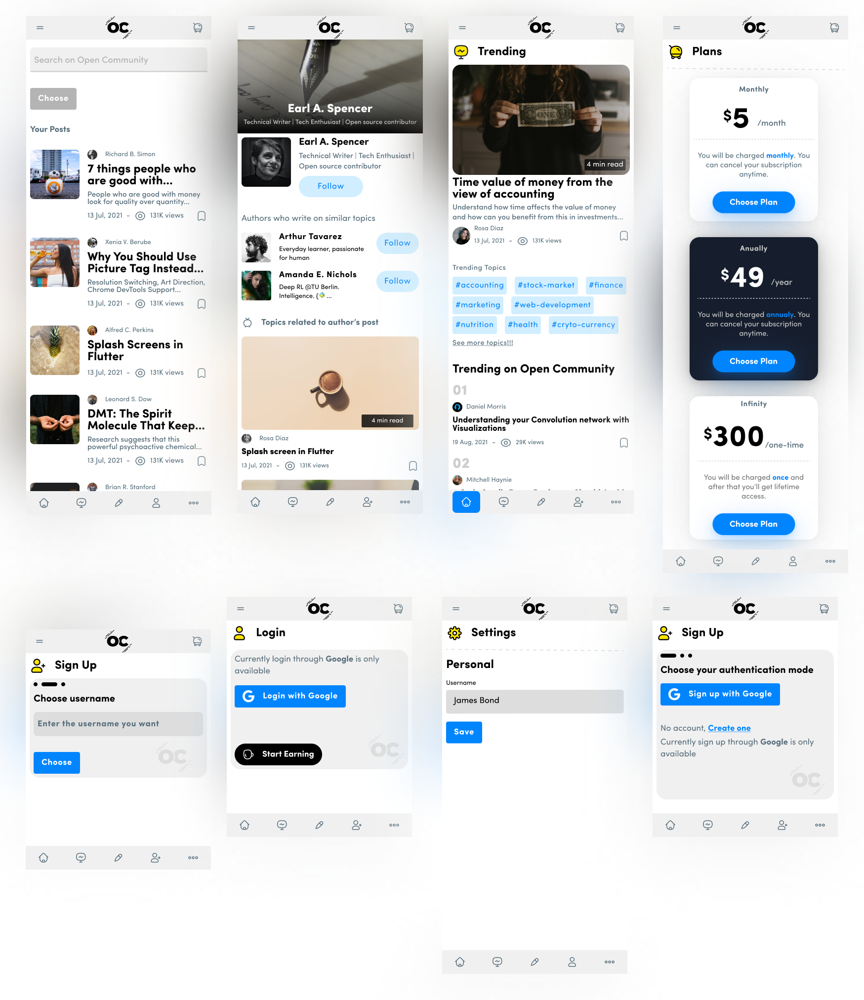

# open-community

Open Community app is inspired by Medium.com. It designs are made using Figma, following all the design principles and following the Design System build for the app and for building the app Next JS, Firebase and TypeScript are used. For payment solutions like subscription Stripe is used.

- UI desiging for app is done using Figma (with Design System)
- Different hydration methods of Next JS are used for good performance and SEO.
- Custom hooks and react-firebase-hooks package are used to work with firebase
- Next JS apis are used for creating api routes for payment solutions
- TypeScript and SASS are used for increasing speed and writing reusable code
- Stripe is used for payment solutions - subscription, webhooks, payment intent, creating customers, integrating with Firebase, 3D secure payments
- In SASS mixins are used for creating Design System for the app

## Getting started

Clone the repo

```bash
git clone https://github.com/AkashSDas/open-community.git
```

Get inside the project folder and install everything

```bash
npm install
```

Setup env variables by creating `.env.local` file at root of the project and add following variables with your values

```.env
NEXT_PUBLIC_FIREBASE_API_KEY=""
NEXT_PUBLIC_FIREBASE_AUTH_DOMAIN=""
NEXT_PUBLIC_FIREBASE_PROJECT_ID=""
NEXT_PUBLIC_FIREBASE_STORAGE_BUCKET=""
NEXT_PUBLIC_FIREBASE_MESSAGING_SENDER_ID=""
NEXT_PUBLIC_FIREBASE_APP_ID=""
NEXT_PUBLIC_FIREBASE_MEASUREMENT_ID=""

NEXT_PUBLIC_BASE_URL="http://localhost:3000/api/"

STRIPE_SECRET=""
STRIPE_WEBHOOK_SECRET=""
```

Listen to stripe webhook by running the following command in terminal (Note: you've to have Stripe CLI downloaded, follow the offical doc to download it in local system). This is needed since webhooks are listened in our local system

```bash
stripe listen --forward-to localhost:8000/api/payments/hooks
```

Trigger stripe webhooks

```bash
stripe trigger customer.subscription.created
stripe trigger customer.subscription.deleted
stripe trigger invoice.failed
stripe trigger payment_intent.failed
```

Listen to different event in stripe by running the following commands

```bash
stripe listen --events=customer.subscription.deleted
stripe listen --events=customer.subscription.created
stripe listen --events=invoice.failed
stripe listen --events=payment_intent.failed
```

Starting the app

```bash
npm run dev
```

## To Do

- Implement validations for forms (Formik)
- Handle errors in frontend and apis in backend
- Give feedback using react-hot-toast
- Create card animation in loading state
- Change styling in navbar when non selected items are hovered
- Add animations using framer-motions
- Implement ISR data hydration techinque for post content page
- Refactor data modelling for app data in firestore
- Implement image upload in firebase storage
- Write firestore and storage security rules
- Write tests for frontend and backend
- Look and change data hydration (according) for different pages
- Optimize images
- Make the app responsive
- Implement hearts and views feature for posts
- Implement comments and replies feature for posts

## App Cover









## License

[MIT](./LICENSE)
